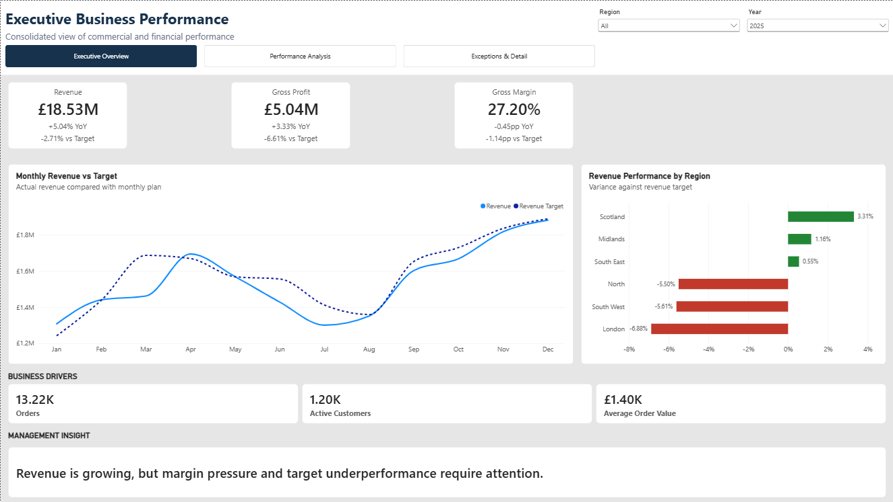
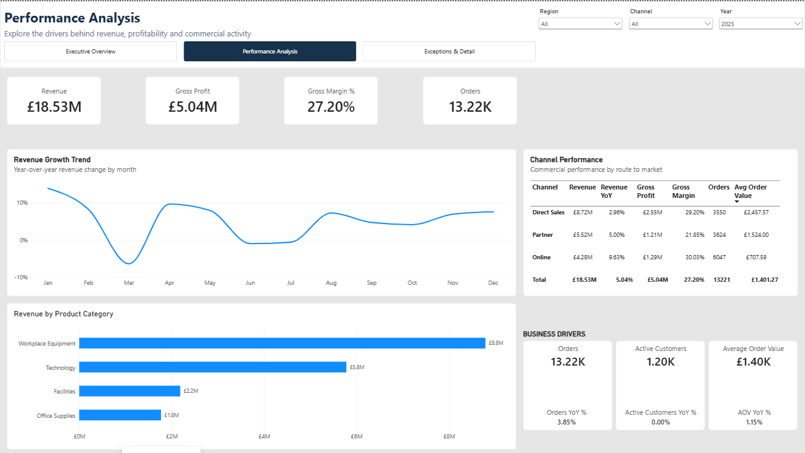
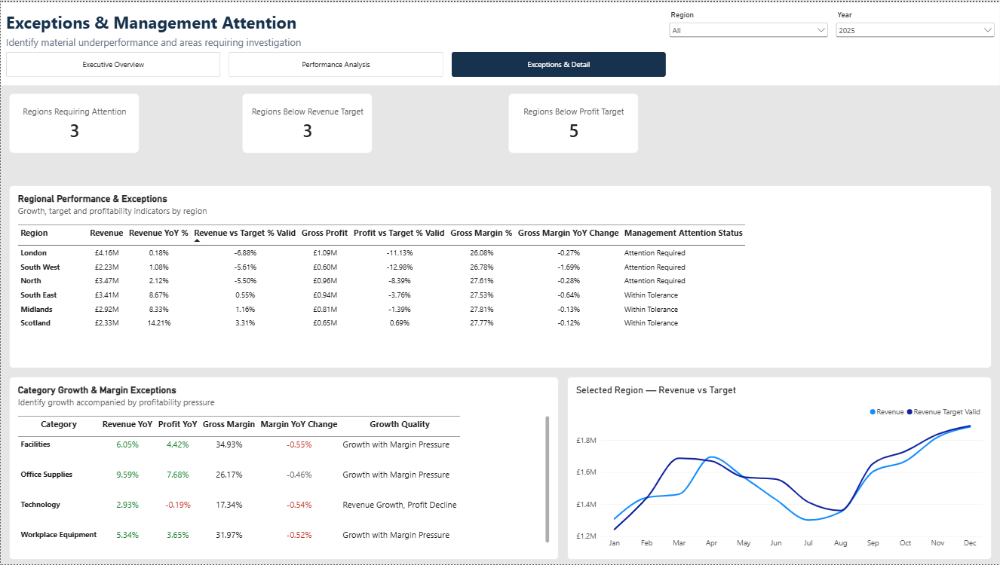
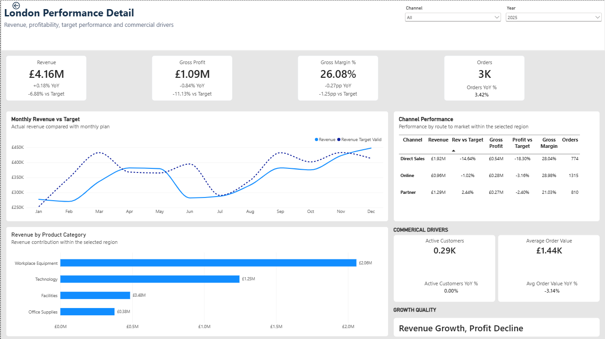
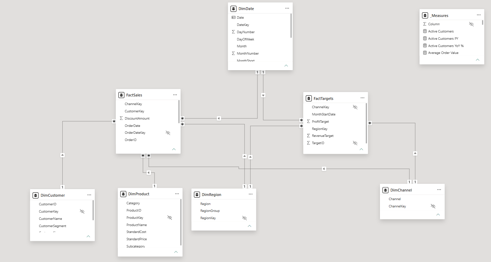
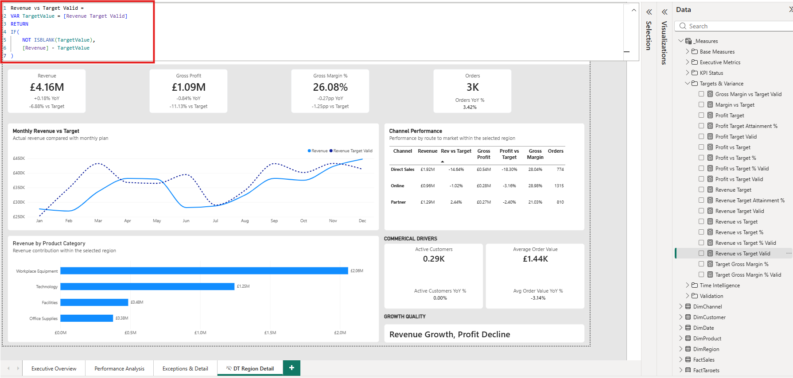

# Executive Business Performance Dashboard

A professional Power BI business intelligence solution designed to provide senior management with a consolidated view of financial performance, commercial activity, targets, trends and management exceptions.

The project demonstrates an executive-first approach to Power BI development, combining dimensional modelling, structured DAX, target-aware calculations, exception reporting and drill-through analysis.

## Project Overview

Senior management needs more than a collection of charts.

They need to quickly understand:

- How the business is performing
- Whether Revenue and Profit are growing
- Whether growth is translating into profitability
- Whether financial targets are being achieved
- Which Regions require management attention
- What commercial factors are influencing performance
- Where further investigation is required

The Executive Business Performance Dashboard was designed around these questions.

The reporting journey follows:

**Monitor → Analyse → Identify Exceptions → Investigate**

## Business Scenario

The solution represents a multi-region business operating across several sales channels and product categories.

Management requires a consolidated reporting solution for:

### CEO / Managing Director

- Overall business health
- Revenue and Profit growth
- Performance against plan
- Material exceptions requiring attention

### Finance Leadership

- Gross Profit
- Gross Margin
- Revenue and Profit targets
- Actual-versus-target variance
- Profitability trends

### Sales Leadership

- Revenue growth
- Channel performance
- Regional performance
- Order activity
- Average Order Value

### Operational Management

- Regional exceptions
- Customer activity
- Product-category performance
- Areas requiring investigation

## Dashboard Preview

### Executive Overview

Provides a concise management view of headline financial KPIs, target performance, regional variance, commercial drivers and the overall management position.

### Performance Analysis

Explores the drivers behind headline performance through monthly growth, channel analysis, product-category contribution and commercial activity.

### Exceptions & Management Attention

Surfaces material regional and profitability exceptions to help management prioritise investigation.

### Regional Drill-Through

Allows users to move from an identified regional exception into detailed monthly, channel and category analysis.

## Key KPIs

The solution includes:

- Revenue
- Gross Profit
- Gross Margin
- Revenue YoY
- Gross Profit YoY
- Gross Margin YoY Change
- Revenue vs Target
- Profit vs Target
- Gross Margin vs Target
- Orders
- Active Customers
- Average Order Value
- Orders YoY
- Active Customers YoY
- Average Order Value YoY

Higher-level management measures include:

- Growth Quality
- Management Attention Status
- Overall Target Position
- Regions Requiring Attention

A complete definition of the KPI framework is available in:

[`documentation/KPI-Dictionary.md`](documentation/KPI-Dictionary.md)

## Data Model

The solution uses a dimensional model designed to support reusable business calculations and predictable filtering.

The model separates transactional business activity, target data and descriptive dimensions.

A key modelling consideration was the difference between the analytical grain of Actuals and Targets.

Targets support dimensions including:

- Time
- Region
- Channel

Product Category is not part of the target grain.

The solution therefore prevents unsupported category-level target comparisons rather than artificially allocating targets to categories.

## DAX Strategy

The measure layer is organised into six functional groups:

Base Measures
    ↓
Time Intelligence
    ↓
Targets & Variance
    ↓
KPI Status
    ↓
Executive Metrics

Validation

### Base Measures

Reusable calculations including Revenue, Cost, Gross Profit, Gross Margin, Orders, Active Customers and Average Order Value.

### Time Intelligence

Prior-year, year-on-year, month-on-month and year-to-date calculations.

### Targets & Variance

Revenue, Profit and Margin target calculations with actual-versus-plan variance measures.

### KPI Status

Business-facing classifications and labels based on quantitative KPI results.

### Executive Metrics

Higher-level measures supporting executive headlines, Growth Quality, management-attention logic and exception counts.

### Validation

Technical measures retained to test target context and semantic-model behaviour.

Detailed measure documentation is available in:

[`documentation/DAX-Measure-Reference.md`](documentation/DAX-Measure-Reference.md)

## Target-Aware Measure Design

One of the key technical requirements was preventing misleading target comparisons.

Actual sales can be analysed by Product Category, while the target dataset does not contain Product Category allocation.

A naive implementation could display apparently valid target figures after category filtering even though no category-level target exists.

The solution uses target-context validation so that target-safe measures return blank where the comparison is analytically unsupported.

This preserves the distinction between:

**A calculation Power BI can technically produce**

and:

**A comparison the business data legitimately supports.**

## Report Architecture

The report contains three primary user-facing pages plus a drill-through page.

| Page | Primary Question |
|---|---|
| Executive Overview | What is happening? |
| Performance Analysis | What is driving it? |
| Exceptions & Management Attention | Where should management investigate? |
| Region Performance Detail | What is happening within this Region? |

A hidden development page is retained for validation and technical QA.

Detailed page specifications are available in:

[`documentation/Report-Page-Specification.md`](documentation/Report-Page-Specification.md)

## Key Insights from the Data

The final dashboard was validated using the 2025 reporting context.

### Revenue grew, but profitability experienced pressure

Revenue reached approximately **£18.53M**, representing **5.04% YoY growth**.

Gross Profit increased by **3.33%**, while Gross Margin declined by approximately **0.45 percentage points** to **27.20%**.

This indicates that Profit growth did not keep pace with Revenue growth.

### Profitability missed plan more materially than Revenue

Revenue finished approximately **2.71% below target**.

Gross Profit was approximately **6.61% below target**, while Gross Margin was approximately **1.14 percentage points below plan**.

The performance gap was therefore more pronounced in profitability than in topline Revenue.

### Growth occurred without expansion of the active customer base

Orders increased approximately **3.85% YoY** and Average Order Value increased approximately **1.15%**, while Active Customers remained broadly flat.

This indicates that the observed Revenue growth occurred without growth in the active customer count.

### Regional performance varied materially

Scotland exceeded Revenue target by approximately **3.31%**.

London recorded the largest regional Revenue target shortfall at approximately **6.88% below plan**.

The exception framework allows management to move from this regional comparison into detailed drill-through investigation.

### Category growth masked profitability pressure

All four Product Categories generated positive Revenue growth while Gross Margin declined.

Technology represented the clearest profitability exception:

- Revenue YoY: **+2.93%**
- Gross Profit YoY: **-0.19%**
- Gross Margin: **17.34%**
- Margin YoY Change: **-0.54pp**

The dashboard classified this pattern as:

**Revenue Growth, Profit Decline**

## Validation & QA

The solution was tested across:

- Base KPI calculations
- Financial reconciliation
- Time intelligence
- 2023 prior-year edge cases
- Revenue and Profit targets
- Target granularity
- Regional filtering
- Channel filtering
- Unsupported Product Category target context
- Cross-filter interactions
- Drill-through
- Navigation
- Conditional formatting
- Executive classifications
- Refresh behaviour
- Report performance

Detailed QA documentation is available in:

[`documentation/Validation-and-QA.md`](documentation/Validation-and-QA.md)

## Technical Highlights

- Dimensional Power BI data model
- Dedicated DAX measure layer
- Measure branching
- Time-intelligence calculations
- Actual-versus-target analysis
- Target-context validation
- Percentage-point margin analysis
- Dynamic executive narrative
- KPI status classifications
- Management exception framework
- Conditional formatting
- Controlled cross-filter behaviour
- Regional drill-through analysis
- Dynamic drill-through titles
- Hidden technical validation page
- Executive-focused report navigation
- Mobile consideration for the Executive Overview
- Performance Analyzer review

## Business Impact

This is a portfolio simulation rather than a production deployment, so no fabricated financial or operational improvements are claimed.

The solution demonstrates how an executive reporting environment can support management by:

- Consolidating financial and commercial KPIs
- Comparing actual performance with plan
- Highlighting profitability pressure
- Identifying regional exceptions
- Distinguishing topline growth from quality of growth
- Supporting structured investigation through drill-through
- Preventing unsupported target comparisons

Any measurable improvement in Revenue, Margin, reporting time or management performance would require evidence from a real deployment and is therefore intentionally not claimed.

## Technology

- Microsoft Power BI Desktop
- DAX
- Power Query
- Dimensional Data Modelling
- CSV source data

## Repository Structure

executive-business-performance-dashboard/
│
├── Data/
├── Power_Bi/
│   └── Executive_Business_Performance_Dashboard.pbix
├── documentation/
│   ├── KPI-Dictionary.md
│   ├── DAX-Measure-Reference.md
│   ├── Report-Page-Specification.md
│   └── Validation-and-QA.md
├── Screenshots/
│   ├── Executive_Overview.png
│   ├── Performance_Analysis.png
│   ├── Exceptions_Management_Attention.png
│   ├── London_Region_Drillthrough.png
│   ├── Data_Model.png
│   ├── Dax_Target_Validation.png
└── README.md

## Documentation

| Document | Purpose |
|---|---|
| [KPI Dictionary](documentation/KPI-Dictionary.md) | Business definitions and KPI calculation principles |
| [DAX Measure Reference](documentation/DAX-Measure-Reference.md) | Structure and purpose of the DAX measure layer |
| [Report Page Specification](documentation/Report-Page-Specification.md) | Page objectives, visuals, interactions and management questions |
| [Validation & QA](documentation/Validation-and-QA.md) | Testing methodology and validated report behaviour |

## Project Status

**Complete**

The Power BI solution, validation, documentation and portfolio evidence have been completed.
